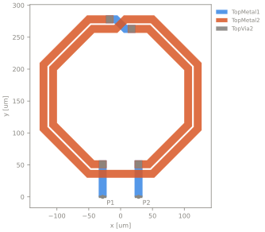
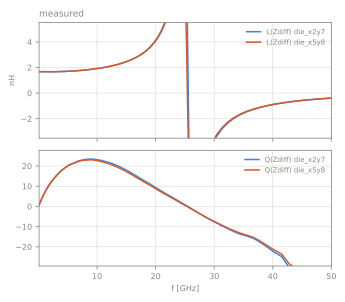
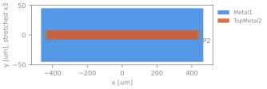
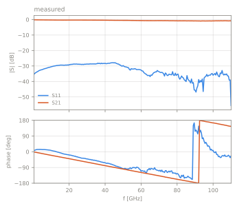

# EM Reference Suite

Measured planar RF structures with layout (GDS), layer stack, ports and measured
S-parameters, for benchmarking EM solvers. License per case.

| status | meaning |
|---|---|
| complete | all values stated by the source |
| reconstructed | some values reconstructed, fitted, assumed or digitized; listed in the case |
| incomplete | open questions; listed in the case |

## Cases

<!-- gallery:begin (generated by `python -m emref build`, do not edit) -->

<table>
<tr><td colspan="2"><a href="cases/hatab_megtron7_step30_1p0mm"><b>Stepped-impedance microstrip 50-30-50 Ohm, 1 mm section, Megtron 7</b></a><br>pcb | stepped_line | stack hatab_megtron7 | 2 ports | 1-150 GHz | reconstructed, 3 values not stated by the source<br><a href="https://github.com/ZiadHatab/verification-multiline-trl-calibration">source</a> | <a href="https://doi.org/10.1109/OJIM.2023.3315349">doi:10.1109/OJIM.2023.3315349</a> | BSD-3-Clause</td></tr>
<tr>
<td width="50%"><a href="cases/hatab_megtron7_step30_1p0mm"></a></td>
<td width="50%"></td>
</tr>
<tr><td colspan="2"><a href="cases/hatab_megtron7_step30_1p5mm"><b>Stepped-impedance microstrip 50-30-50 Ohm, 1.5 mm section, Megtron 7</b></a><br>pcb | stepped_line | stack hatab_megtron7 | 2 ports | 1-150 GHz | reconstructed, 3 values not stated by the source<br><a href="https://github.com/ZiadHatab/verification-multiline-trl-calibration">source</a> | <a href="https://doi.org/10.1109/OJIM.2023.3315349">doi:10.1109/OJIM.2023.3315349</a> | BSD-3-Clause</td></tr>
<tr>
<td width="50%"><a href="cases/hatab_megtron7_step30_1p5mm"></a></td>
<td width="50%"></td>
</tr>
<tr><td colspan="2"><a href="cases/hatab_megtron7_step30_2p0mm"><b>Stepped-impedance microstrip 50-30-50 Ohm, 2 mm section, Megtron 7</b></a><br>pcb | stepped_line | stack hatab_megtron7 | 2 ports | 1-150 GHz | reconstructed, 3 values not stated by the source<br><a href="https://github.com/ZiadHatab/verification-multiline-trl-calibration">source</a> | <a href="https://doi.org/10.1109/OJIM.2023.3315349">doi:10.1109/OJIM.2023.3315349</a> | BSD-3-Clause</td></tr>
<tr>
<td width="50%"><a href="cases/hatab_megtron7_step30_2p0mm"></a></td>
<td width="50%"></td>
</tr>
<tr><td colspan="2"><a href="cases/hatab_megtron7_step30_4p0mm"><b>Stepped-impedance microstrip 50-30-50 Ohm, 4 mm section, Megtron 7</b></a><br>pcb | stepped_line | stack hatab_megtron7 | 2 ports | 1-150 GHz | reconstructed, 3 values not stated by the source<br><a href="https://github.com/ZiadHatab/verification-multiline-trl-calibration">source</a> | <a href="https://doi.org/10.1109/OJIM.2023.3315349">doi:10.1109/OJIM.2023.3315349</a> | BSD-3-Clause</td></tr>
<tr>
<td width="50%"><a href="cases/hatab_megtron7_step30_4p0mm"></a></td>
<td width="50%"></td>
</tr>
<tr><td colspan="2"><a href="cases/hatab_megtron7_step30_6p0mm"><b>Stepped-impedance microstrip 50-30-50 Ohm, 6 mm section, Megtron 7</b></a><br>pcb | stepped_line | stack hatab_megtron7 | 2 ports | 1-150 GHz | reconstructed, 3 values not stated by the source<br><a href="https://github.com/ZiadHatab/verification-multiline-trl-calibration">source</a> | <a href="https://doi.org/10.1109/OJIM.2023.3315349">doi:10.1109/OJIM.2023.3315349</a> | BSD-3-Clause</td></tr>
<tr>
<td width="50%"><a href="cases/hatab_megtron7_step30_6p0mm"></a></td>
<td width="50%"></td>
</tr>
<tr><td colspan="2"><a href="cases/hatab_megtron7_step30_7p5mm"><b>Stepped-impedance microstrip 50-30-50 Ohm, 7.5 mm section, Megtron 7</b></a><br>pcb | stepped_line | stack hatab_megtron7 | 2 ports | 1-150 GHz | reconstructed, 3 values not stated by the source<br><a href="https://github.com/ZiadHatab/verification-multiline-trl-calibration">source</a> | <a href="https://doi.org/10.1109/OJIM.2023.3315349">doi:10.1109/OJIM.2023.3315349</a> | BSD-3-Clause</td></tr>
<tr>
<td width="50%"><a href="cases/hatab_megtron7_step30_7p5mm"></a></td>
<td width="50%"></td>
</tr>
<tr><td colspan="2"><a href="cases/hatab_sma_fr4_step90"><b>Stepped-impedance microstrip 50-90-50 Ohm, 20 mm section, FR4</b></a><br>pcb | stepped_line | stack hatab_sma_fr4 | 2 ports | 0.1-14 GHz | reconstructed, 5 values not stated by the source<br><a href="https://github.com/ZiadHatab/SMA-PCB-mTRL-kit">source</a> | MIT</td></tr>
<tr>
<td width="50%"><a href="cases/hatab_sma_fr4_step90"></a></td>
<td width="50%"></td>
</tr>
<tr><td colspan="2"><a href="cases/ihp_sg13g2_l2n0"><b>L2n0 octagonal inductor, 2 turns, 2 nH, IHP SG13G2</b></a><br>onchip | inductor | stack ihp_sg13g2 | 2 ports | 0.1-50 GHz | incomplete, 3 open questions<br><a href="https://github.com/IHP-GmbH/IHP-Open-PDK/tree/943983786b04351feb20e33e8d3d76c0e0d87cce/ihp-sg13g2/libs.tech/openems/testcase">source</a> | Apache-2.0</td></tr>
<tr>
<td width="50%"><a href="cases/ihp_sg13g2_l2n0"></a></td>
<td width="50%"></td>
</tr>
<tr><td colspan="2"><a href="cases/ihp_sg13g2_l6n2"><b>L6n2 octagonal spiral inductor, 4 turns, IHP SG13G2</b></a><br>onchip | inductor | stack ihp_sg13g2 | 2 ports | 0.1-50 GHz | incomplete, 4 open questions<br><a href="https://github.com/VolkerMuehlhaus/gds2palace_ihp_sg13g2/tree/main/more_examples/measured_vs_simulated/more_accurate_models_L6n2_v2">source</a> | GPL-3.0-or-later</td></tr>
<tr>
<td width="50%"><a href="cases/ihp_sg13g2_l6n2"></a></td>
<td width="50%"></td>
</tr>
<tr><td colspan="2"><a href="cases/ihp_sg13g2_line880"><b>Microstrip line TopMetal2 over Metal1, 880 um, IHP SG13G2</b></a><br>onchip | line | stack ihp_sg13g2 | 2 ports | 0.5-110 GHz | incomplete, 1 open questions<br><a href="https://github.com/IHP-GmbH/IHP-Open-PDK/tree/943983786b04351feb20e33e8d3d76c0e0d87cce/ihp-sg13g2/libs.tech/openems/testcase">source</a> | Apache-2.0</td></tr>
<tr>
<td width="50%"><a href="cases/ihp_sg13g2_line880"></a></td>
<td width="50%"></td>
</tr>
<tr><td colspan="2"><a href="cases/teraytech_bpf_10g"><b>Coupled-line band-pass filter, 10 GHz, RO4350B</b></a><br>pcb | filter | stack teraytech_ro4350b | 2 ports | 0.01-18 GHz | incomplete, 3 open questions<br><a href="https://github.com/TerayTech/microstrip_filters">source</a> | MIT</td></tr>
<tr>
<td width="50%"><a href="cases/teraytech_bpf_10g"></a></td>
<td width="50%"></td>
</tr>
<tr><td colspan="2"><a href="cases/teraytech_lpf_5g"><b>Radial-stub microstrip low-pass filter, 5 GHz, RO4350B</b></a><br>pcb | filter | stack teraytech_ro4350b | 2 ports | 0.01-18 GHz | incomplete, 3 open questions<br><a href="https://github.com/TerayTech/microstrip_filters">source</a> | MIT</td></tr>
<tr>
<td width="50%"><a href="cases/teraytech_lpf_5g"></a></td>
<td width="50%"></td>
</tr>
<tr><td colspan="2"><a href="cases/teraytech_lpf_8g"><b>Radial-stub microstrip low-pass filter, 8 GHz, RO4350B</b></a><br>pcb | filter | stack teraytech_ro4350b | 2 ports | 0.01-18 GHz | incomplete, 3 open questions<br><a href="https://github.com/TerayTech/microstrip_filters">source</a> | MIT</td></tr>
<tr>
<td width="50%"><a href="cases/teraytech_lpf_8g"></a></td>
<td width="50%"></td>
</tr>
</table>

<!-- gallery:end -->

## Candidates

Sources not yet usable as cases (`candidates.yaml`).

<!-- candidates:begin (generated by `python -m emref build`, do not edit) -->

| source | domain | license | blocked by | missing |
|---|---|---|---|---|
| [OnMicro on-wafer interlaboratory comparison, HR-Si CPW, 10 GHz to 1.1 THz](https://doi.org/10.5281/zenodo.23042690) | onwafer | CC-BY-4.0 | geometry | Layout of the comparison devices. The paper gives the dimensions of the thru only. |
| [METAS / NPL CPW line on GGB CS-5 alumina, 1 to 65 GHz](https://doi.org/10.5281/zenodo.22643057) | onwafer | CC-BY-4.0 | geometry | Probe pad geometry (the reference plane is at the probe tips) and the substrate thickness. Data are in METAS VNA Tools format. |
| [NPL / MPI / Anritsu attenuators and loads to 220 GHz](https://doi.org/10.5281/zenodo.22658069) | onwafer | CC-BY-4.0 | geometry | Any layout or dimensions, and the thin-film resistor data. |
| [Hatab, FormFactor ISS 104-783 CPW lines, raw waves 1 to 150 GHz](https://github.com/ZiadHatab/uncertainty-multiline-trl-calibration) | onwafer | BSD-3-Clause | quantity | The structures are calibration standards, so the benchmark quantity is the propagation constant, which the suite does not carry yet. Substrate thickness not given. |
| [Hatab, MPI ISS CPW lines to 150 GHz](https://github.com/ZiadHatab/uncertainty-multiline-trl-calibration) | onwafer | BSD-3-Clause | geometry | Cross-section and substrate of the MPI ISS. |
| [Hatab, Tachyon 100G microstrip kit, 1 to 50 GHz](https://github.com/ZiadHatab/srm-calibration) | pcb | BSD-3-Clause | geometry | Layout of the stepped-line DUT, numeric er and tand, roughness. |
| [TU Graz probe-measured PCB kits to 150 GHz (stripline on Tachyon 100G, microstrip on Astra MT77 with surface finishes, GCPW on Megtron 7 with a Ka-band metasurface filter)](https://arxiv.org/abs/2512.18641) | pcb | unknown | not public | The data and layouts are not published. |
| [IEEE P370 de-embedding plug-and-play kit (Signal Microwave)](https://opensource.ieee.org/elec-char/ieee-370) | pcb | BSD-3-Clause (repository); the board DXF carries "Copyright 2018 Signal Microwave" | license | A clear license for the board drawings, the 2x-thru measurement that would move the reference plane onto the board, and Dk/Df of the laminates. |
| [Ammann, multilayer SMA to microstrip transition on Aisler 6-layer](https://github.com/toammann/Multilayer_SMA2Microstrip) | pcb | CC0-1.0 | 3d | The case is a coax-to-planar transition with edge plating; it needs 3D geometry beside the GDS, which the suite does not support yet. |
| [Ammann, comb line for multi-term Debye experiments](https://github.com/toammann/OpenEMS_MultiTermDebyeExperiments) | pcb | none | license | A license, and the layout of the long board. |
| [scikit-rf MSL and CPWG example lines on milled FR-4](https://github.com/scikit-rf/scikit-rf/tree/master/doc/source/examples/networktheory) | pcb | BSD-3-Clause | geometry | SMA connectors are in the data, er and tand are fitted to the same lines, and the via wall positions of the CPWG are not given. |
| [Antmicro signal integrity test board (gerber2ems examples)](https://github.com/antmicro/gerber2ems) | pcb | Apache-2.0 | connector | SMA connectors are in the data, mostly one-port, generic FR-4 values (4.18 / 0.02). |
| [IHP SG13G2 RF pad dummies (module S439S)](https://github.com/IHP-GmbH/IHP-Open-PDK/tree/main/ihp-sg13g2/libs.doc/meas) | onchip | Apache-2.0 | geometry | The map from measured device to cell in the module GDS, and the calibration method. |
| [IHP SG13CMOS5L MoM capacitors (TEST9203)](https://github.com/KrzysztofHerman/IHP__TEST9203) | onchip | Apache-2.0 | not public | Measurements, not published yet. |
| [Muehlhaus, TopMetal2 over Metal1 microstrip lines on SG13G2 (880 and 2580 um)](https://github.com/VolkerMuehlhaus/gds2palace_ihp_sg13g2) | onchip | GPL-3.0-or-later | not public | The data files and the GDS of the measured structures. |

<!-- candidates:end -->

## Layout

```
stacks/<name>.yaml          shared layer stacks
cases/<id>/case.yaml        source, stack, ports, measurements, band
cases/<id>/stack.yaml       board-specific stack
cases/<id>/layout.gds       geometry
cases/<id>/measured/        measured data
cases/<id>/results/         solver results
schema/                     JSON Schema
emref/                      tooling
```

## Usage

```bash
pip install -e .
python -m emref validate
python -m emref build       # figures and READMEs
python -m emref check       # validate + stale check (CI)
```
