# EM Reference Suite

A corpus of measured planar RF structures for benchmarking electromagnetic solvers.
Every case brings what a MoM or FEM solver needs to reproduce the measurement
without guessing: the layout as GDS, the layer stack with all material parameters,
the port definition at the reference plane of the measurement, and the measured
S-parameters, with a link to the original source.

Only cases from public sources whose license permits redistribution are included.
The license of each case is stated with it.

Each case carries a status, derived from its data rather than stated:

- **complete**: every value is stated by the source (PDK, datasheet or measurement)
  and the layout is the original or a lossless conversion of it.
- **reconstructed**: some values were reconstructed from other source material,
  fitted, or assumed, or the layout was rebuilt from dimensions. The case README
  lists each of them. Values fitted to the same measurement make a comparison
  against it partly circular.
- **incomplete**: questions remain open that keep the case from being reproduced
  as measured. The case README lists them.

## Cases

<!-- gallery:begin (generated by `python -m emref build`, do not edit) -->

<table>
<tr>
<td width="50%"><a href="cases/hatab_megtron7_step30_1p0mm">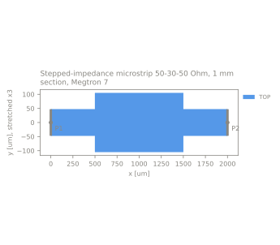</a></td>
<td width="50%">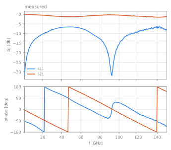<br><a href="cases/hatab_megtron7_step30_1p0mm"><b>Stepped-impedance microstrip 50-30-50 Ohm, 1 mm section, Megtron 7</b></a><br>pcb | stepped_line | stack hatab_megtron7 | 2 ports | 1-150 GHz<br>reconstructed, 3 values not stated by the source<br><a href="https://github.com/ZiadHatab/verification-multiline-trl-calibration">source</a> | <a href="https://doi.org/10.1109/OJIM.2023.3315349">doi:10.1109/OJIM.2023.3315349</a> | BSD-3-Clause</td>
</tr>
<tr>
<td width="50%"><a href="cases/hatab_megtron7_step30_1p5mm">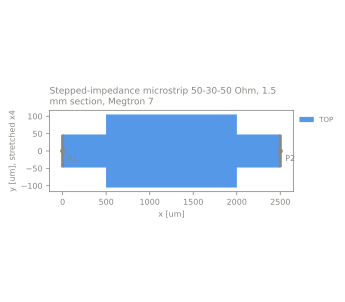</a></td>
<td width="50%">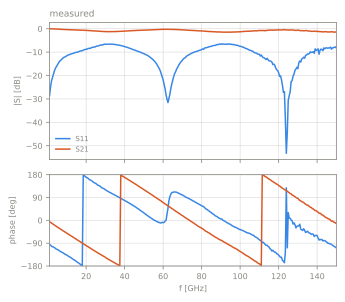<br><a href="cases/hatab_megtron7_step30_1p5mm"><b>Stepped-impedance microstrip 50-30-50 Ohm, 1.5 mm section, Megtron 7</b></a><br>pcb | stepped_line | stack hatab_megtron7 | 2 ports | 1-150 GHz<br>reconstructed, 3 values not stated by the source<br><a href="https://github.com/ZiadHatab/verification-multiline-trl-calibration">source</a> | <a href="https://doi.org/10.1109/OJIM.2023.3315349">doi:10.1109/OJIM.2023.3315349</a> | BSD-3-Clause</td>
</tr>
<tr>
<td width="50%"><a href="cases/hatab_megtron7_step30_2p0mm">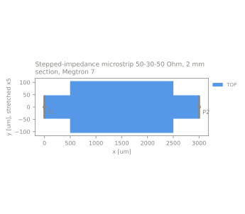</a></td>
<td width="50%">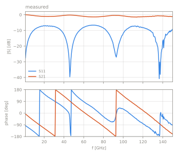<br><a href="cases/hatab_megtron7_step30_2p0mm"><b>Stepped-impedance microstrip 50-30-50 Ohm, 2 mm section, Megtron 7</b></a><br>pcb | stepped_line | stack hatab_megtron7 | 2 ports | 1-150 GHz<br>reconstructed, 3 values not stated by the source<br><a href="https://github.com/ZiadHatab/verification-multiline-trl-calibration">source</a> | <a href="https://doi.org/10.1109/OJIM.2023.3315349">doi:10.1109/OJIM.2023.3315349</a> | BSD-3-Clause</td>
</tr>
<tr>
<td width="50%"><a href="cases/hatab_megtron7_step30_4p0mm">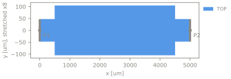</a></td>
<td width="50%">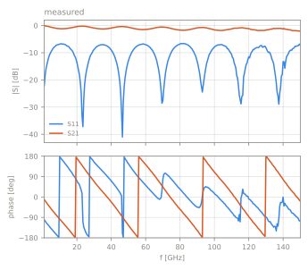<br><a href="cases/hatab_megtron7_step30_4p0mm"><b>Stepped-impedance microstrip 50-30-50 Ohm, 4 mm section, Megtron 7</b></a><br>pcb | stepped_line | stack hatab_megtron7 | 2 ports | 1-150 GHz<br>reconstructed, 3 values not stated by the source<br><a href="https://github.com/ZiadHatab/verification-multiline-trl-calibration">source</a> | <a href="https://doi.org/10.1109/OJIM.2023.3315349">doi:10.1109/OJIM.2023.3315349</a> | BSD-3-Clause</td>
</tr>
<tr>
<td width="50%"><a href="cases/hatab_megtron7_step30_6p0mm"></a></td>
<td width="50%"><br><a href="cases/hatab_megtron7_step30_6p0mm"><b>Stepped-impedance microstrip 50-30-50 Ohm, 6 mm section, Megtron 7</b></a><br>pcb | stepped_line | stack hatab_megtron7 | 2 ports | 1-150 GHz<br>reconstructed, 3 values not stated by the source<br><a href="https://github.com/ZiadHatab/verification-multiline-trl-calibration">source</a> | <a href="https://doi.org/10.1109/OJIM.2023.3315349">doi:10.1109/OJIM.2023.3315349</a> | BSD-3-Clause</td>
</tr>
<tr>
<td width="50%"><a href="cases/hatab_megtron7_step30_7p5mm">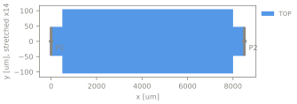</a></td>
<td width="50%">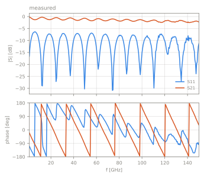<br><a href="cases/hatab_megtron7_step30_7p5mm"><b>Stepped-impedance microstrip 50-30-50 Ohm, 7.5 mm section, Megtron 7</b></a><br>pcb | stepped_line | stack hatab_megtron7 | 2 ports | 1-150 GHz<br>reconstructed, 3 values not stated by the source<br><a href="https://github.com/ZiadHatab/verification-multiline-trl-calibration">source</a> | <a href="https://doi.org/10.1109/OJIM.2023.3315349">doi:10.1109/OJIM.2023.3315349</a> | BSD-3-Clause</td>
</tr>
<tr>
<td width="50%"><a href="cases/hatab_sma_fr4_step90"></a></td>
<td width="50%"><br><a href="cases/hatab_sma_fr4_step90"><b>Stepped-impedance microstrip 50-90-50 Ohm, 20 mm section, FR4</b></a><br>pcb | stepped_line | stack hatab_sma_fr4 | 2 ports | 0.1-14 GHz<br>reconstructed, 5 values not stated by the source<br><a href="https://github.com/ZiadHatab/SMA-PCB-mTRL-kit">source</a> | MIT</td>
</tr>
<tr>
<td width="50%"><a href="cases/ihp_sg13g2_l6n2"></a></td>
<td width="50%"><br><a href="cases/ihp_sg13g2_l6n2"><b>L6n2 octagonal spiral inductor, 4 turns, IHP SG13G2</b></a><br>onchip | inductor | stack ihp_sg13g2_200um | 2 ports | 0.1-50 GHz<br>incomplete, 4 open questions<br><a href="https://github.com/VolkerMuehlhaus/gds2palace_ihp_sg13g2/tree/main/more_examples/measured_vs_simulated/more_accurate_models_L6n2_v2">source</a> | GPL-3.0-or-later</td>
</tr>
<tr>
<td width="50%"><a href="cases/teraytech_bpf_10g">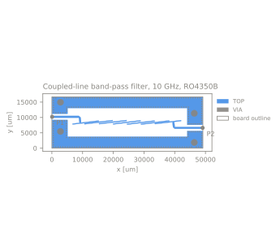</a></td>
<td width="50%">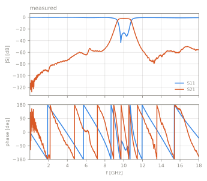<br><a href="cases/teraytech_bpf_10g"><b>Coupled-line band-pass filter, 10 GHz, RO4350B</b></a><br>pcb | filter | stack teraytech_ro4350b | 2 ports | 0.01-18 GHz<br>incomplete, 3 open questions<br><a href="https://github.com/TerayTech/microstrip_filters">source</a> | MIT</td>
</tr>
<tr>
<td width="50%"><a href="cases/teraytech_lpf_5g">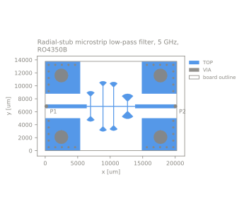</a></td>
<td width="50%">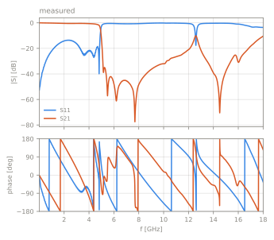<br><a href="cases/teraytech_lpf_5g"><b>Radial-stub microstrip low-pass filter, 5 GHz, RO4350B</b></a><br>pcb | filter | stack teraytech_ro4350b | 2 ports | 0.01-18 GHz<br>incomplete, 3 open questions<br><a href="https://github.com/TerayTech/microstrip_filters">source</a> | MIT</td>
</tr>
<tr>
<td width="50%"><a href="cases/teraytech_lpf_8g"></a></td>
<td width="50%"><br><a href="cases/teraytech_lpf_8g"><b>Radial-stub microstrip low-pass filter, 8 GHz, RO4350B</b></a><br>pcb | filter | stack teraytech_ro4350b | 2 ports | 0.01-18 GHz<br>incomplete, 3 open questions<br><a href="https://github.com/TerayTech/microstrip_filters">source</a> | MIT</td>
</tr>
</table>

<!-- gallery:end -->

## Repository layout

```
stacks/<name>.yaml          layer stack: dielectrics, conductors, boundaries, provenance
cases/<id>/
    case.yaml               source, stack reference, ports, measurements, band
    layout.gds              the geometry, normative
    measured/*.sNp          measured S-parameters
    results/<tool>-<ver>/   contributed solver results
    README.md, *.svg        generated
schema/                     JSON Schema for stacks and cases
emref/                      loader, validation, rendering
```

## Usage

```bash
pip install -e .
python -m emref validate     # schema, geometry, ports, hashes, Touchstone sanity
python -m emref build        # regenerate figures and READMEs
python -m emref check        # validate and fail on stale generated files (CI)
```
