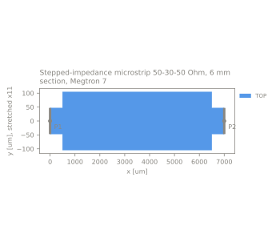
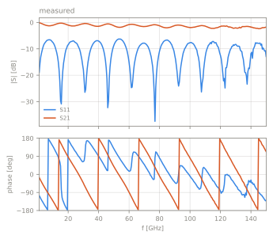

# Stepped-impedance microstrip 50-30-50 Ohm, 6 mm section, Megtron 7

pcb | stepped_line | stack `hatab_megtron7` | 2 ports | 1-150 GHz

Status: **reconstructed**, 3 values not stated by the source

<table><tr>
<td width="50%"></td>
<td width="50%"></td>
</tr></table>

## Source

- Authors: Ziad Hatab, Michael Ernst Gadringer, Ahmad Bader Alothman Alterkawi, Wolfgang Boesch
- URL: https://github.com/ZiadHatab/verification-multiline-trl-calibration (commit `021e7359b77c33507a407f6b35205dbe9152e467`)
- DOI: [10.1109/OJIM.2023.3315349](https://doi.org/10.1109/OJIM.2023.3315349)
- License: BSD-3-Clause
- Cite as: Z. Hatab et al., IEEE Open Journal of Instrumentation and Measurement, vol. 2, pp. 1-12, 2023

## Measurements

| label | file | reference plane | calibration |
|---|---|---|---|
| tug | `measured/tug.s2p` | P1 and P2: middle of the thru of the 50 Ohm multiline TRL kit, 0.5 mm before each impedance step | GSG probes (150 um pitch), multiline TRL with eight 50 Ohm lines (0 to 6.5 mm) and an offset open on the same board |

## Ports

| port | kind | drives | returns to | segment [um] | de-embed [um] | Z0 [Ohm] |
|---|---|---|---|---|---|---|
| P1 | line | TOP | bottom_boundary | (0, -47) - (0, 47) | 0 | line Z0 |
| P2 | line | TOP | bottom_boundary | (7000, -47) - (7000, 47) | 0 | line Z0 |

## Stack `hatab_megtron7`

Bottom boundary: conductor, sigma 5.8e+07 S/m, top boundary: open. z is absolute from the bottom of the lowest dielectric.

| dielectric | z [um] | er | tan d | model | sigma [S/m] | provenance |
|---|---|---|---|---|---|---|
| Megtron 7 prepreg | 0 - 48 | 3.04 | 0.0022 | constant | - | datasheet (thickness_um: measured) |

| conductor | kind | GDS | z [um] | sigma [S/m] | provenance |
|---|---|---|---|---|---|
| TOP | metal | 1/0 | 48 - 61 | 5.8e+07 | measured (sigma_s_per_m: assumed) |

Cross-section tolerances (Table I of the source): substrate 48 +- 2 um, trace thickness 13 +- 7 um. The dielectric is glass cloth style 1027 in resin at 77 percent resin content; the paper estimates the local permittivity seen by a line between about 2.5 (resin) and 5 (glass) and uses 3.04 +- 0.42. The copper is bare, with no surface finish and no solder mask; its conductivity is the ideal value assumed by the source, and its roughness is not stated. The source's HFSS model fits er 3.2 and tand 0.002 to the same measurements.

## Notes

The calibration uses all eight 50 Ohm lines of the board, the source paper used six of them. Trace widths are 94 um and 209 um, each +-15 um from cross-sections; along the line the width varies within that tolerance. The S-parameters are normalised to the characteristic impedance of the 94 um line, so a solver result has to be normalised the same way (de-embedded wave port on the 50 Ohm line, or renormalised to its computed Z0). The calibrated data are reciprocal to 0.003 below 5 GHz, but |S12 - S21| grows to about 0.1 at 150 GHz with |S12/S21| = 1, a phase difference. The source's own multiline TRL code gives the identical result, so this is a property of the measurement (probe contact repeatability between standards and DUT is the likely cause) and a measure of its uncertainty at the top of the band.

## Values not stated by the source

Reconstructed, fitted or assumed; see the stack notes for how.

- layout reconstructed from dimensions or drawings
- bottom boundary: sigma_s_per_m assumed
- conductor TOP: sigma_s_per_m assumed

Generated by `python -m emref build`. Do not edit by hand.
