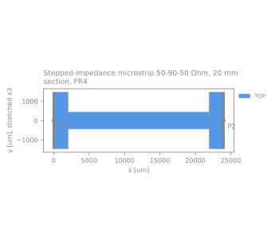
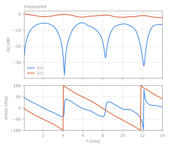

# Stepped-impedance microstrip 50-90-50 Ohm, 20 mm section, FR4

pcb | stepped_line | stack `hatab_sma_fr4` | 2 ports | 0.1-14 GHz

Status: **reconstructed**, 5 values not stated by the source

<table><tr>
<td width="50%"></td>
<td width="50%"></td>
</tr></table>

## Source

- Authors: Ziad Hatab
- URL: https://github.com/ZiadHatab/SMA-PCB-mTRL-kit (commit `031c6947e991b8d8807231ca0fbf627c27d32279`)
- License: MIT

## Measurements

| label | file | reference plane | calibration |
|---|---|---|---|
| tug | `measured/tug.s2p` | on the two impedance steps, 25 mm from each board edge | multiline TRL on a separate board of the same order with identical SMA launches: five 50 Ohm lines (0 to 50 mm) and a symmetric short; switch terms measured |

## Ports

| port | kind | drives | returns to | segment [um] | Z0 [Ohm] |
|---|---|---|---|---|---|
| P1 | line | TOP | bottom_boundary | (0, -1470.5) - (0, 1470.5) | line Z0 |
| P2 | line | TOP | bottom_boundary | (24000, 1470.5) - (24000, -1470.5) | line Z0 |

## Stack `hatab_sma_fr4`

Bottom boundary: conductor, sigma 5.8e+07 S/m, top boundary: open. z is absolute from the bottom of the lowest dielectric.

| dielectric | z [um] | er | tan d | sigma [S/m] | provenance |
|---|---|---|---|---|---|
| FR4 core | 0 - 1520 | 4.839 | 0.0202 | - | reconstructed (thickness_um: assumed) |

| conductor | kind | GDS | z [um] | sigma [S/m] | provenance |
|---|---|---|---|---|---|
| TOP | metal | 1/0 | 1520 - 1555 | 5.8e+07 | datasheet (sigma_s_per_m: assumed) |

er 4.839 and tand 0.0202 at 1 GHz are fitted to the propagation constant of the calibration lines (0.5 to 14 GHz) with a Djordjevic-Sarkar dielectric and smooth copper, so tand also absorbs the excess conductor loss of the rough foil. The fit is insensitive to the core thickness: 1.50 to 1.55 mm changes er by less than 0.01. 1.52 mm is the core of a 1.6 mm finished board, 35 um the 1 oz outer copper of the board house. The lines are not covered by solder mask; the surface finish of the copper is not stated.

## Notes

The source measured to 20 GHz but finds the lines usable only to 14 GHz, the band kept here. The DUT and the calibration standards sit on different boards, so board-to-board variation of the launches and of the substrate enters the result. S-parameters are normalised to the characteristic impedance of the 50 Ohm line.

## Values not stated by the source

Reconstructed, fitted or assumed; see the stack notes for how.

- bottom boundary: sigma_s_per_m assumed
- dielectric FR4 core: thickness_um assumed
- dielectric FR4 core: er reconstructed
- dielectric FR4 core: tand reconstructed
- conductor TOP: sigma_s_per_m assumed

Generated by `python -m emref build`. Do not edit by hand.
