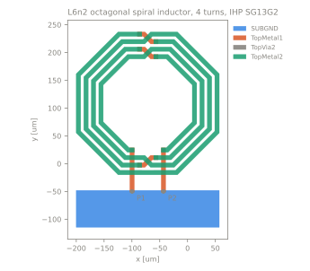
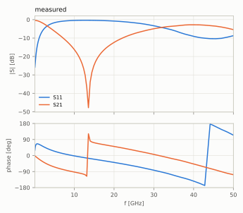

# L6n2 octagonal spiral inductor, 4 turns, IHP SG13G2

onchip | inductor | stack `ihp_sg13g2_200um` | 2 ports | 0.1-50 GHz

<table><tr>
<td width="50%"></td>
<td width="50%"></td>
</tr></table>

## Source

- Authors: Volker Muehlhaus, IHP
- URL: https://github.com/VolkerMuehlhaus/gds2palace_ihp_sg13g2/tree/main/more_examples/measured_vs_simulated/more_accurate_models_L6n2_v2 (commit `101e119fc08469fa3547eface93e1edc2dddfad7`)
- License: GPL-3.0-or-later

## Measurements

| label | file | reference plane | calibration |
|---|---|---|---|
| ihp | `measured/ihp.s2p` | lead ends at y = -50 um, assuming the de-embedding removes pads and feeds up to there | probe-tip calibration, then THRU-dummy de-embedding (method not documented) |

## Ports

| port | kind | drives | returns to | segment [um] | Z0 [Ohm] |
|---|---|---|---|---|---|
| P1 | vertical | TopMetal1 | SUBGND | (-103.675, -50) - (-95.675, -50) | 50 |
| P2 | vertical | TopMetal1 | SUBGND | (-47.305, -50) - (-39.305, -50) | 50 |

## Stack `ihp_sg13g2_200um`

Bottom boundary: open, top boundary: open. z is absolute from the bottom of the lowest dielectric.

| dielectric | z [um] | er | tan d | sigma [S/m] | provenance |
|---|---|---|---|---|---|
| Passive | 196.48 - 196.88 | 6.6 | 0 | - | pdk |
| SiO2 | 183.75 - 196.48 | 4.1 | 0 | - | pdk |
| EPI | 180 - 183.75 | 11.9 | 0 | 5 | pdk |
| Substrate | 0 - 180 | 11.9 | 0 | 2 | pdk |

| conductor | kind | GDS | z [um] | sigma [S/m] | provenance |
|---|---|---|---|---|---|
| TopMetal2 | metal | 134/0 | 194.98 - 197.98 | 3.03e+07 | pdk |
| TopVia2 | via | 133/0 | 192.18 - 194.98 | 3.143e+06 | pdk |
| TopMetal1 | metal | 126/0 | 190.18 - 192.18 | 2.78e+07 | pdk |
| TopVia1 | via | 125/0 | 189.33 - 190.18 | 2.191e+06 | pdk |
| Metal5 | metal | 67/0 | 188.84 - 189.33 | 2.319e+07 | pdk |
| Via4 | via | 66/0 | 188.3 - 188.84 | 1.66e+06 | pdk |
| Metal4 | metal | 50/0 | 187.81 - 188.3 | 2.319e+07 | pdk |
| Via3 | via | 49/0 | 187.27 - 187.81 | 1.66e+06 | pdk |
| Metal3 | metal | 30/0 | 186.78 - 187.27 | 2.319e+07 | pdk |
| Via2 | via | 29/0 | 186.24 - 186.78 | 1.66e+06 | pdk |
| Metal2 | metal | 10/0 | 185.75 - 186.24 | 2.319e+07 | pdk |
| Via1 | via | 19/0 | 185.21 - 185.75 | 1.66e+06 | pdk |
| Metal1 | metal | 8/0 | 184.79 - 185.21 | 2.164e+07 | pdk |
| SUBGND | metal | 250/0 | 180 - 183.75 | PEC | assumed |

| conformal dielectric | over | er | tan d | top [um] | side [um] | provenance |
|---|---|---|---|---|---|---|
| TM2 oxide shell | TopMetal2 | 4.1 | 0 | 1.9 | 0.6 | pdk |

SUBGND is not a process layer. It is the ideal local ground the de-embedded measurement is referenced to, filling the EPI layer where it is drawn; vertical ports start on it. Via conductivities are the PDK effective values for a filled via layer, not plug geometry. Activ, Cont, MIM and the resistor layers are not modelled. The conformal shell replaces the planar dielectrics inside it: 1.9 um of oxide above TopMetal2 (1.5 um oxide plus 0.4 um passivation in the process, modelled as oxide) and 0.6 um on the sidewalls.

## Notes

The upstream study reports L = 5.01 nH, peak Q 15.96 at 4.71 GHz and a measured self-resonance of 11.07 GHz, and reaches agreement in SRF within 0.1 to 1 percent only with the conformal oxide over TopMetal2 that the stack carries.

## Open questions

Until these are answered the case stays out of the gallery.

- Which de-embedding was applied (THRU dummy only, open-short, other), and where exactly does it put the reference plane relative to this GDS?
- The full test structure GDS (pads, feeds, ground ring, fill) and the dummy structures used for de-embedding.
- Was the die measured on a metal chuck (then the bottom boundary is PEC at the backside) and is the final thickness 200 um?
- Which physical terminal is port 1 of the measurement?

Generated by `python -m emref build`. Do not edit by hand.
