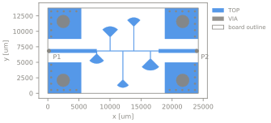
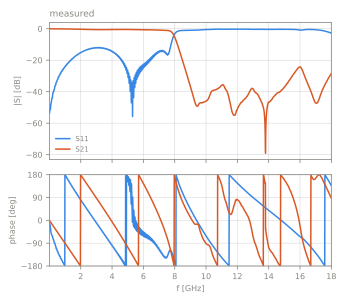

# Radial-stub microstrip low-pass filter, 8 GHz, RO4350B

pcb | filter | stack `teraytech_ro4350b` | 2 ports | 0.01-18 GHz

Status: **incomplete**, 3 open questions

<table><tr>
<td width="50%"></td>
<td width="50%"></td>
</tr></table>

## Source

- Authors: TerayTech RF Works
- URL: https://github.com/TerayTech/microstrip_filters (commit `1ae960799e0048960539dba38e34655237a50236`)
- License: MIT

## Measurements

| label | file | reference plane | calibration |
|---|---|---|---|
| keysight | `measured/keysight.s2p` | coaxial, at the SMA connector interfaces; the connectors and their launch are part of the data | 2-port coaxial calibration of the VNA (type not stated) |

## Ports

| port | kind | drives | returns to | segment [um] | de-embed [um] | Z0 [Ohm] |
|---|---|---|---|---|---|---|
| P1 | edge | TOP | bottom_boundary | (178.8, 6549.6) - (178.8, 7114.4) | 0 | 50 |
| P2 | edge | TOP | bottom_boundary | (23980, 6554) - (23980, 7118.7) | 0 | 50 |

## Stack `teraytech_ro4350b`

Bottom boundary: conductor, sigma 5.8e+07 S/m, top boundary: open. z is absolute from the bottom of the lowest dielectric.

| dielectric | z [um] | er | tan d | model | sigma [S/m] | provenance |
|---|---|---|---|---|---|---|
| RO4350B-class laminate | 0 - 254 | 3.66 | 0.0037 | constant | - | datasheet (tand: assumed) |

| conductor | kind | GDS | z [um] | sigma [S/m] | provenance |
|---|---|---|---|---|---|
| TOP | metal | 1/0 | 254 - 289 | 5.8e+07 | datasheet (sigma_s_per_m: assumed) |
| VIA | via | 2/0 | 0 - 254 | 5.8e+07 | assumed |

From FAB_DOC.md of the source: RO4350B for the RF layer (Dk 3.66, Df 0.0037, 0.254 mm), FR-4 below, 1 oz ED copper, OSP finish, no solder mask over the circuits. The boards were built on a Chinese RO4350B variant with the same Dk and a lower, unstated Df, so tand is an upper bound. The layer thicknesses are described by the source as approximated to a 0.8 mm board. Plated holes are modelled as solid copper cylinders from the ground plane to the top copper.

## Notes

Ports are placed where the signal trace meets the board edge, as edge ports to the ground plane under the laminate. The ground pads beside the trace at both edges are the launch pads of the connectors.

## Open questions

- The data include the SMA end-launch connectors (SMA-KHD23), which are not part of the layout. A connector model or a measurement of the connector pair (thru) is needed to move the reference plane onto the board.
- Drill diameters are read from the drill guide crosses ([0.305, 2.1] mm); the source has no NC drill file. Whether the large holes are plated is not stated.
- Actual loss tangent of the RO4350B-class laminate and the true layer thicknesses of the hybrid stack.

Generated by `python -m emref build`. Do not edit by hand.
